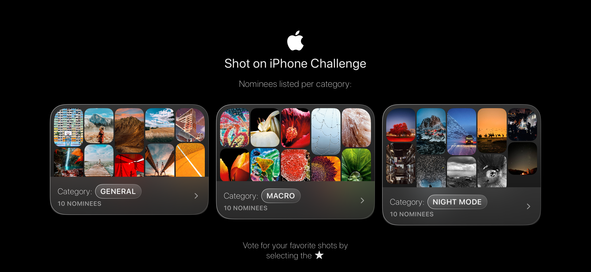

<p align="center">
  
</p>

## Concept

This demo app recreates the Instagram Stories experience using images from Apple's Newsroom as sample content. The app showcases:

- **Story Collections**: Multiple story sets that users can browse
- **Interactive Stories**: Full-screen story viewing with automatic progression
- **Smooth Animations**: Custom 3D cube transitions and matched geometry effects
- **Modern UI**: Glass morphism design with haptic feedback

The project serves as a demonstration of modern iOS development techniques, including state management, custom layouts, image caching, and advanced SwiftUI animations.

<p align="center">
  
  
  
  
</p>

## Architecture

### tinyTCA Implementation

The app is built using **tinyTCA** (The Composable Architecture), providing a clean, testable, and scalable architecture:

```swift
// Main app entry point with TCA store
@main
struct tinyStoriesApp: App {
    let store = Store(feature: StoryListFeature())
    // ...
}
```

**Key Architecture Components:**

- **Features**: Self-contained modules (`StoryListFeature`, `StoryFeature`) with their own state, actions, and effects
- **State Management**: Centralized state with predictable state updates through reducers
- **Side Effects**: Async operations handled through the effect system
- **Dependency Injection**: Clean separation of concerns with mockable dependencies

**Feature Structure:**

```swift
struct StoryListFeature: Feature {
    struct State: Sendable, Equatable {
        var storyCollections: RequestState<[StoryCollection]> = .idle
        var selectedStory: UUID?
    }
    
    enum Action: Sendable {
        case loadStoryCollections
        case selectStory(UUID?)
    }
    
    func reducer(state: inout State, action: Action) throws {
        // Pure state transformations
    }
    
    func effect(for action: Action, state: State) async throws -> Action? {
        // Side effects and async operations
    }
}
```

## Data Management

### API Layer (tinyAPI)

The app uses **tinyAPI** for clean, type-safe network requests:

```swift
struct APIClientDependency {
    let client: any APIClientProtocol
    
    static let live = APIClientDependency(client: TinyAPIClient.live)
    static let mock = APIClientDependency(client: MockTinyAPIClient.demo)
}
```

**API Features:**

- **Type Safety**: Endpoint definitions with compile-time safety
- **Dependency Injection**: Easy mocking for testing and previews
- **Error Handling**: Comprehensive error types and handling
- **Request/Response Models**: Structured data models for all API interactions

### Image Caching

Advanced image caching system with disk persistence:

```swift
enum DiskImageCache {
    // SHA256-based cache keys for unique identification
    private static func key(for url: URL) -> String {
        let digest = SHA256.hash(data: Data(url.absoluteString.utf8))
        return digest.map { String(format: "%02x", $0) }.joined()
    }
    
    // Persistent storage with atomic writes
    static func save(_ data: Data, for url: URL) {
        try? data.write(to: path, options: [.atomic])
    }
}
```

**Caching Features:**

- **Disk Persistence**: Images cached to disk for offline access
- **Memory Efficiency**: SHA256-based cache keys prevent collisions
- **Atomic Operations**: Safe concurrent access with atomic writes
- **Network Integration**: Seamless fallback to network when cache misses

### App Storage

Persistent state management using `@AppStorage`:

```swift
struct LikeButton: View {
    @AppStorage var isLiked: Bool
    
    init(id: Int, store: UserDefaults? = .standard) {
        _isLiked = AppStorage(wrappedValue: false, "liked.\(id)", store: store)
    }
}
```

**Storage Features:**

- **User Preferences**: Like states persist across app launches
- **Key-Value Storage**: Efficient storage using UserDefaults
- **Type Safety**: Strongly typed storage with default values
- **Per-Item Storage**: Individual storage keys for each story item

## Design

### Layouts

#### Masonry Layout

Custom masonry layout for story thumbnails:

```swift
struct MasonryLayout: Layout {
    let columns: Int
    let spacing: CGFloat
    
    // Intelligent column assignment based on content height
    private func indexOfShortestColumn(_ heights: [CGFloat]) -> Int {
        // Assigns items to the shortest column for optimal layout
    }
}
```

**Layout Features:**

- **Dynamic Columns**: Configurable column count
- **Smart Assignment**: Items placed in shortest column
- **Performance Optimized**: Cached calculations for smooth scrolling
- **Responsive**: Adapts to different screen sizes

#### Flow Layout

Flexible flow layout for story collections with automatic wrapping and spacing.

### Styling

Comprehensive design system with consistent styling:

```swift
// Typography
extension Font {
    static let primaryTitle: Self = .system(size: 20, weight: .regular, design: .rounded)
    static let secondaryTitle: Self = .system(size: 18, weight: .regular, design: .rounded)
}

// Spacing
struct Padding {
    static let outer: CGFloat = 12
    static let inner: CGFloat = 4
}

// Glass morphism effects
extension ShapeStyle where Self == LinearGradient {
    static var glassFill: AnyShapeStyle {
        // Translucent glass effect with gradient
    }
}
```

**Styling Features:**

- **Design System**: Consistent typography, spacing, and colors
- **Glass Morphism**: Modern translucent UI elements
- **Dark Mode**: Optimized for dark color scheme
- **Accessibility**: High contrast and readable typography

### Effects

#### 3D Cube Transition

Custom 3D cube effect for story transitions:

```swift
@MainActor
private struct CubeEffect: ViewModifier {
    func body(content: Content) -> some View {
        content
            .scrollTransition(.interactive(timingCurve: .linear), axis: .horizontal) { content, phase in
                content
                    .rotation3DEffect(
                        cubeAngle(phase.value),
                        axis: (x: 0, y: 1, z: 0),
                        anchor: cubeAnchor(phase.value),
                        perspective: 2.5
                    )
                    .opacity(1 - abs(phase.value * 0.6))
            }
    }
}
```

**Animation Features:**

- **3D Transitions**: Smooth cube rotation effects
- **Interactive**: Responds to scroll gestures
- **Performance**: Hardware-accelerated 3D transforms
- **Customizable**: Configurable timing and easing

#### Matched Geometry

Smooth transitions between story list and full-screen story view using matched geometry effects.

#### Haptic Feedback

Contextual haptic feedback for user interactions:

```swift
@Environment(\.hapticsManager) private var haptics

// Trigger haptics on user actions
haptics.trigger()
```

## Scalability

### Modular Architecture
- **Feature-Based Organization**: Each feature is self-contained
- **Dependency Injection**: Easy to swap implementations
- **Testable**: Clear separation of concerns enables comprehensive testing

## Maintainability

### Code Organization
- **Clear Structure**: Logical file organization by feature
- **Separation of Concerns**: UI, business logic, and data layers separated
- **Consistent Patterns**: Standardized approach across all features

## Areas for Improvement

### Add Testing Infrastructure
- add unit tests for Features (reducers and effects)
- add integration tests for API layer

### Error Handling
- implement comprehensive error handling strategy
- add retry mechanisms for network failures